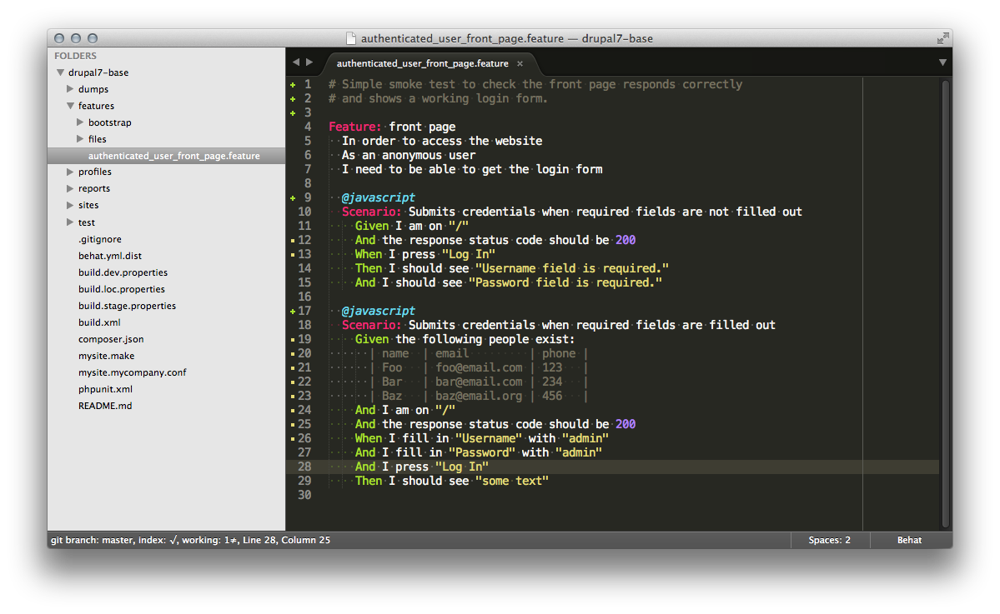

#Sublime Behat Syntax Highlight

## Installation

Clone the repo in your personal SublimeText[2|3]/Packages folder.

## Basic usage

The syntax highlighting will be automatically applied to .feature files.

The Behat syntax highlight can be found in the menu under View > Syntax > Behat.

## Screenshot

Here's an example of how the plugin highlights Behat code:

